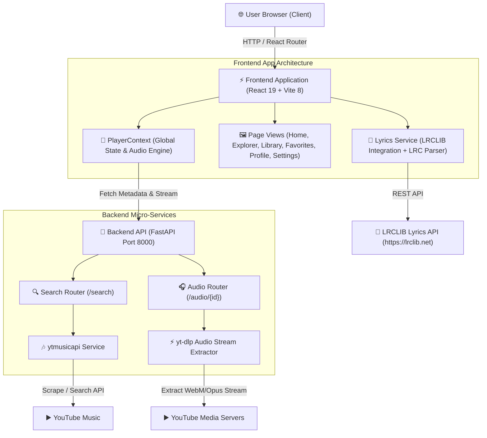
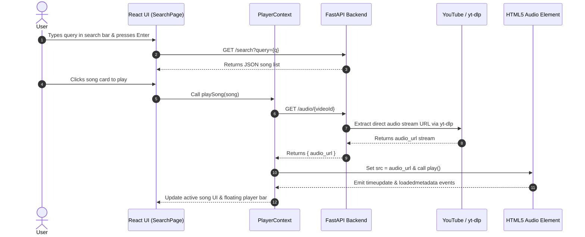

# 🏛️ Symphony Music Player — System Architecture & Design Document

This document provides a comprehensive technical overview of the architecture, data flow, component interactions, design patterns, and service layer specifications of the **Symphony Music Player**.

---

## 📋 Table of Contents
- [1. System Overview](#1-system-overview)
- [2. High-Level System Architecture](#2-high-level-system-architecture)
- [3. Backend Architecture](#3-backend-architecture)
  - [3.1 FastAPI Application & Routers](#31-fastapi-application--routers)
  - [3.2 YouTube Music Service (`ytmusicapi`)](#32-youtube-music-service-ytmusicapi)
  - [3.3 Audio Extractor Service (`yt-dlp`)](#33-audio-extractor-service-yt-dlp)
- [4. Frontend Architecture](#4-frontend-architecture)
  - [4.1 Component Tree & Page Flow](#41-component-tree--page-flow)
  - [4.2 Player Context & State Flow](#42-player-context--state-flow)
  - [4.3 Synchronized Live Lyrics Engine](#43-synchronized-live-lyrics-engine)
- [5. Data Flow & Sequence Diagrams](#5-data-flow--sequence-diagrams)
- [6. Data Storage & State Persistence](#6-data-storage--state-persistence)
- [7. Design System — Symphony Design Language (SDL)](#7-design-system--symphony-design-language-sdl)
- [8. Performance & Security Optimizations](#8-performance--security-optimizations)
- [9. Future Roadmap](#9-future-roadmap)

---

## 1. System Overview

**Symphony** is a high-performance, web-based music streaming platform designed with a modern decoupled architecture. The frontend application is built using **React 19**, **Vite 8**, **Tailwind CSS v4**, and **Framer Motion**, delivering an immersive, glassmorphic UI. The backend is an asynchronous **FastAPI** Python application that interfaces with YouTube Music to provide search indexing, track metadata, and direct audio stream extraction.

---

## 2. High-Level System Architecture



---

## 3. Backend Architecture

The backend layer is designed as a stateless API built on **FastAPI** and served using **Uvicorn**.

### 3.1 FastAPI Application & Routers
- **`src/main.py`**: Initializes the FastAPI app, configures CORS middleware for frontend origins (`http://localhost:5173`, `http://localhost:5174`), and mounts route handlers.
- **`src/routes/search.py`**: Exposes `GET /search?query={q}&limit={n}`, invoking the `ytmusic_service`.
- **`src/routes/audio.py`**: Exposes `GET /audio/{video_id}`, invoking `audio_service`.

### 3.2 YouTube Music Service (`ytmusicapi`)
Defined in `src/services/ytmusic_service.py`:
- Performs structured searches for song objects.
- Implements defensive null-checks for artist names, album titles, and thumbnail resolutions.
- Standardizes output schema:
  ```json
  {
    "videoId": "string",
    "title": "string",
    "artist": "string",
    "album": "string",
    "duration": "string",
    "thumbnail": "string"
  }
  ```

### 3.3 Audio Extractor Service (`yt-dlp`)
Defined in `src/services/audio_service.py`:
- Constructs target URL: `https://www.youtube.com/watch?v={video_id}`.
- Extracts `bestaudio/best` format URL asynchronously without local file downloading (`download=False`).
- Returns direct playable audio URL string to the HTML5 audio element.

---

## 4. Frontend Architecture

### 4.1 Component Tree & Page Flow
- **`MainLayout.jsx`**: Global application shell containing the sticky `TopNav`, collapsible `Sidebar`, main scroll container (`<Outlet />`), floating glassmorphic `MusicPlayer`, and `MobileNav`.
- **Pages**:
  - `HomePage.jsx`: Time-aware hero greeting, continue listening grid, recently played, trending tracks.
  - `SearchPage.jsx` (Explorer): Genre grid cards, trending topic tags, search results integration.
  - `LibraryPage.jsx`: Custom playlists list and playlist creation dialog.
  - `FavoritesPage.jsx`: Liked songs tracklist view with play collection action.
  - `ProfilePage.jsx`: Dedicated user profile page with Explorer-style glass cards, account statistics, and interactive tab views.
  - `SettingsPage.jsx`: System control center for streaming audio quality, theme modes, volume normalization, and storage cache.

### 4.2 Player Context & State Flow
- **`PlayerContext.jsx`**: Centralized state store managing:
  - Active audio instance (`HTMLAudioElement`).
  - Playback status (`isPlaying`, `currentTime`, `duration`).
  - Queue array, index pointer, `isShuffle`, and `isRepeat` toggles.
  - Persistence for `favorites`, `playlists`, `recentlyPlayed`, and `continueListening`.
  - Floating toast event dispatcher (`showToast`).

### 4.3 Synchronized Live Lyrics Canvas
- **`lyricsService.js`**: High-performance lyrics service integrating with **LRCLIB**.
- **Multi-tiered Fallback Strategy**:
  1. Exact Get with raw title & artist.
  2. Exact Get with cleaned title & artist (stripping `(Official Video)`, `[Lyric Video]`, `- Title Track`).
  3. Search query with clean title + clean artist.
  4. Search query with clean title only.
- **Script Normalization**: Converts Gurmukhi/Punjabi Unicode characters to Hindi Devanagari script for seamless presentation.
- **LRC Parser (`utils/parseLRC.js`)**: Converts standard timestamped LRC lines (`[mm:ss.xx]`) into structured arrays for live highlight tracking.

---

## 5. Data Flow & Sequence Diagrams

### Search and Audio Playback Sequence



---

## 6. Data Storage & State Persistence

Symphony uses browser `localStorage` keys to persist client-side preferences and state without requiring external database dependencies:

| Key | Type | Description |
| :--- | :--- | :--- |
| `favorites` | `Array<Song>` | Saved liked songs list |
| `playlists` | `Array<Playlist>` | User created playlists with metadata |
| `recentlyPlayed` | `Array<Song>` | Last 6 listened tracks |
| `continueListening` | `Array<Song>` | Track history for quick resume |
| `symphony_user_profile` | `Object` | User display name, email, bio, avatar gradient |
| `symphony_theme` | `string` | Active theme (`Dark`, `Midnight`, `AMOLED`, `Cyberpunk`) |
| `symphony_audio_quality` | `string` | Streaming quality preset |
| `symphony_volume_norm` | `Object` | Volume normalization toggle & LUFS target |

---

## 7. Design System — Symphony Design Language (SDL)

- **Glassmorphism**: Built using `backdrop-blur-3xl`, `bg-gradient-to-br`, and `border border-white/10`.
- **Specular Hairline Highlights**: Top borders featuring `bg-gradient-to-r from-transparent via-purple-400/60 to-transparent`.
- **Ambient Radial Glows**: Positioned background radial gradient orbs (`bg-purple-600/15 rounded-full blur-[150px]`).
- **Typography**: Clean, high-legibility hierarchy using system font features and Tailwind tracking utilities.

---

## 8. Performance & Security Optimizations

1. **In-Memory Lyrics Cache**: Prevents duplicate HTTP requests for lyrics during repeat playback.
2. **Defensive API Extraction**: Prevents runtime crashing when third-party video metadata contains missing fields.
3. **Event-Driven Profile Sync**: Dispatches custom window events (`symphony-profile-updated`) to update navbar elements without requiring full-page re-renders.
4. **CORS Hardening**: Explicitly allows specific development origin ports.

---

## 9. Future Roadmap

- 📱 Progressive Web App (PWA) offline audio support.
- 🎛️ Dynamic 10-band WebAudio Equalizer integration.
- 📡 WebSocket real-time synchronized group listening sessions.